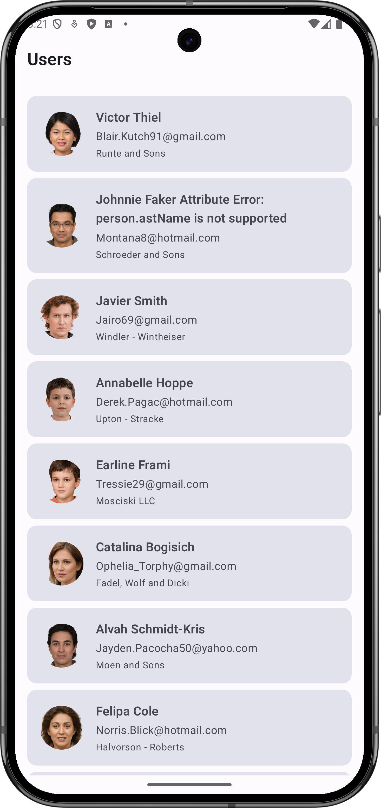
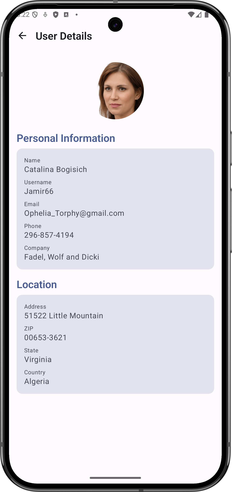
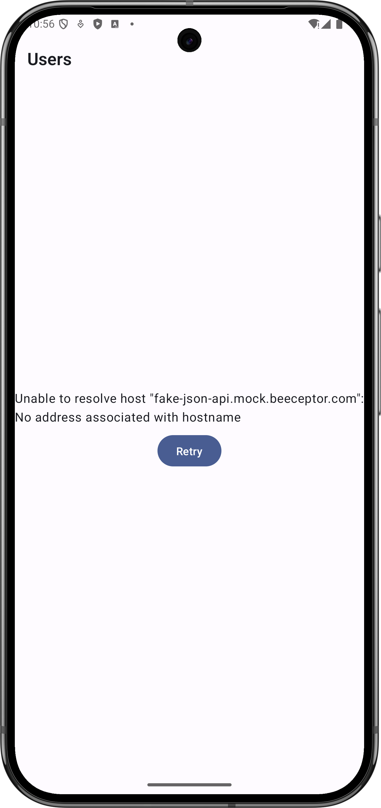

# User Explorer

A modern Android application built with Kotlin and Jetpack Compose that allows users to explore and manage user data.

## 🎯 Project Overview

This project demonstrates:
- Clean Architecture implementation with MVI pattern
- Modern Android development practices
- SOLID principles adherence
- Test-driven development approach
- Scalable and maintainable codebase

## 🛠 Technologies Used

- **Kotlin**
- **Kotlin Flow**
- **Jetpack Compose**
- **Material 3**
- **Dagger Hilt**
- **Kotlinx Serialization**
- **Android Architecture Components**
  - Navigation Compose
  - Lifecycle
  - ViewModel
- **Coroutines**
- **Clean Architecture**
- **MVI (Model-View-Intent)**
- **Retrofit**
- **Coil**
- **MockK**

## 📦 Build System

- **Gradle with Kotlin DSL**
  - Version catalog for dependency management
  - Centralized version control
  - Type-safe dependency declarations
  - Modular project structure
  - Build configuration as code

## 📱 Screenshots

| Users List                                                                 | User Details                                                                  | Error State                                                               |
|----------------------------------------------------------------------------|-------------------------------------------------------------------------------|---------------------------------------------------------------------------|
|  |  |  |
| List of users                                                              | Detailed user information                                                     | Error handling with retry option                                          |

## 🎬 Demo Video

[](videos/UserExplorerDemo.mov)

**[▶ Watch demo video](videos/UserExplorerDemo.mov)**

## 🏗 Architecture

The project follows Clean Architecture principles combined with MVI pattern and is organized into the following modules:

> Use cases omitted intentionally for scope — the ViewModel calls the repository directly.

```
app/
├── core/
│   ├── data/         # Data layer implementation
│   │   ├── remote/   # Remote data sources
│   │   ├── repository/ # Repository implementations
│   │   └── model/    # Data models (DTOs)
│   └── domain/       # Domain layer
│       ├── model/    # Domain models
│       ├── repository/ # Repository interfaces
│       └── usecase/  # Use cases
├── feature/
│   └── users/        # Users feature module
│       ├── di/       # Feature-specific dependency injection
│       └── presentation/ # UI layer
│           ├── list/    # User list screen
│           └── detail/  # User detail screen
└── app/              # Application module
    ├── di/          # Dependency injection
    ├── navigation/  # Navigation setup
    └── theme/       # UI theme
```

### Architecture Diagram

```
┌─────────────────────────────────────────────────────────────────────────┐
│                           Presentation Layer (MVI)                      │
│                                                                         │
│  ┌─────────────┐    ┌─────────────┐    ┌───────────────────────────┐    │
│  │    UI       │    │  ViewModel  │    │        Navigation         │    │
│  │  (Compose)  │◄───┤ (StateFlow) │◄───┤    (Navigation Compose)   │    │
│  └─────────────┘    └─────────────┘    └───────────────────────────┘    │
└───────────────────────────┬─────────────────────────────────────────────┘
                            │
┌───────────────────────────▼─────────────────────────────────────────────┐
│                           Domain Layer                                  │
│                                                                         │
│  ┌─────────────┐    ┌─────────────┐    ┌───────────────────────────┐    │
│  │  UseCase    │    │  Domain     │    │ Repository Interface      │    │
│  │  (Flow)     │◄───┤  Model      │◄───┤    (Contract)             │    │
│  └─────────────┘    └─────────────┘    └───────────────────────────┘    │
└───────────────────────────┬─────────────────────────────────────────────┘
                            │
┌───────────────────────────▼─────────────────────────────────────────────┐
│                           Data Layer                                    │
│                                                                         │
│  ┌─────────────┐    ┌─────────────┐    ┌───────────────────────────┐    │
│  │Repository   │    │ Remote      │    │         DTO               │    │
│  │   Impl      │◄───┤ DataSource  │◄───┤     (Data Object)         │    │
│  └─────────────┘    └─────────────┘    └───────────────────────────┘    │
└─────────────────────────────────────────────────────────────────────────┘

Data Flow:
1. UI triggers Intent in ViewModel
2. ViewModel processes Intent and updates State
3. ViewModel executes UseCase
4. UseCase uses Repository
5. Repository fetches data from DataSource
6. Data flows back up through the layers
7. UI updates via StateFlow
```

## 🧪 Testing Strategy

- **Unit Tests**
  - ViewModels
  - Repositories
  - Data Sources
  - Mappers

- **UI Tests (Compose)**
  - Users list screen
  - User detail screen

### Running Tests

Run all unit tests:

```bash
./gradlew test
```

Run Compose UI tests on a connected device or emulator:

```bash
./gradlew :feature:users:connectedDebugAndroidTest
```

Tests follow the **Arrange / Act / Assert** pattern for clarity and consistency.

## 💡 Key Features

- **Clean Architecture**
  - Clear separation of concerns
  - Independent of frameworks
  - Testable business logic
  - Independent of UI
  - Independent of data

- **MVI Pattern**
  - Unidirectional data flow
  - Predictable state management
  - Easy to test
  - Clear state representation

- **Error Handling**
  - Graceful error states
  - Retry mechanisms
  - User-friendly error messages

## 🔄 Future Improvements

1. **Feature Enhancements**
   - Add user search functionality
   - Add offline support

2. **Architecture**
   - Implement error handling strategy
   - Add analytics tracking
   - Implement proper logging system

## 📝 Code Quality

- **Clean Code Practices**
  - SOLID Principles
  - Meaningful naming
  - Small functions
  - DRY (Don't Repeat Yourself)
  - KISS (Keep It Simple, Stupid)